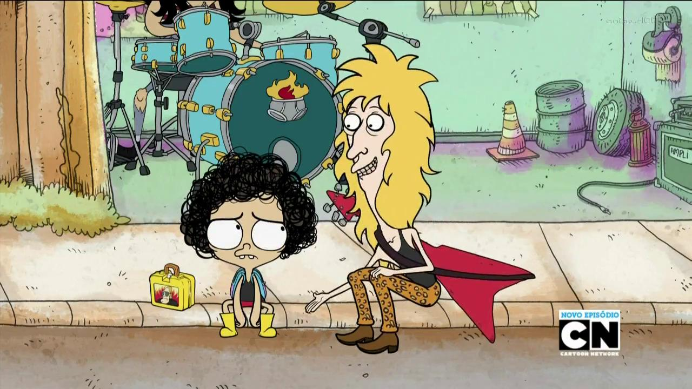

# FrameBot JorelPostBot 

Algorithms for taking random frames from a video file and post them on the twitter timeline.

Random frame example(taken and posted by the bot):
  

The image is saved in a selected directory, then it is posted using the Twitter API. After posting, the algorithm will delete the saved image file to avoid unnecessary memory use of the users pc/server.

Check the Bot out! https://twitter.com/BotJorel 

